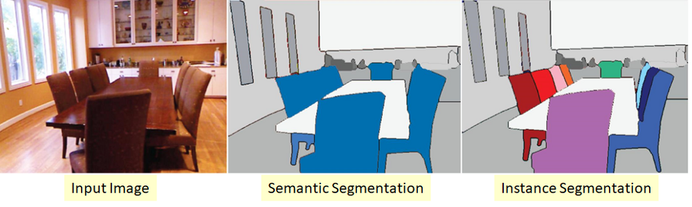

## Introduction ##

We try out a few methods in live object detection with the main focus on person detection.

## Dependencies ## 

- Added [requirements.txt](requirements.txt); Dependencies can be installed using the following pip command

```
pip install -r requirements.txt --no-index --find-links file:///tmp/packages
``` 

## Methods ##

1) Haar-cascades: Three different cascades were tried (face eyes and full body). Had little success with full body and eyes while the results were not bad with the face cascades.
The face recognition too only works on front profile, which is not satisfactory.

```
# To see the options/arguments
python detection_using_haar_cascade.py --help

# to run on webcam with Default settings
python detection_using_haar_cascade.py
```


2) Histogram of oriented Gradients (HoGDescripter): We use the HoG people descriptor provided by cv2 to detect people. The video with bounding boxes is saved to [data/outvideos](data/outvideos)

```
# To see the options/arguments
python detection_using_HoG.py --help

# to run on webcam with Default settings
python detection_using_HoG.py
```

This simple technique also works with very limited accuracy. Works well with people at a distance and less accurate with close objects.

3) YOLO v3: This is the state of the art algorithm in object detection. It has a 106 layer fully convolutional underlying architecture and incorporates upsampling, skip connections 
and residual blocks, which were not a part of YOLO V2. While this extra deep architecture runs slower than the previous version, the detection here is done at 3 different scales, which makes it much 
better at identifying smaller objects. We download the pretrained weights (trained on COCO dataset with 80 classes) using the following command and place it in the [config](config/) folder.

```
wget https://pjreddie.com/media/files/yolov3.weights
```

- As expected, the detection accuracy is extreamly high with this compared to the above 2 methods. 
For finding the accuracy of live human detection, we save all frames and check in how many frames detections were falsely made or missed.

- Using the above, F1 score comes to:  0.90 (Precision=1 and recall=124/151 from 151 relevant frames)

- Also, the live people count is also shown by counting instances of people.

To run this code,
```
# To see the options/arguments
python detection_using_darknet.py --help

# to run on webcam with Default settings
python detection_using_darknet.py
```

Listing out all available options :
```
usage: detection_using_darknet.py [-h] [-v VIDEO] [-c CONFIG] [-o ONLY]
                                  [-s SAVE] [-w WRITE]

Run Object Detection on Video: Live/Saved

optional arguments:
  -h, --help            show this help message and exit
  -v VIDEO, --video VIDEO
                        video on which you want to run object detection;
                        default is live which opens a live webcam stream.
                        Other option is to provide path to a video file.
  -c CONFIG, --config CONFIG
                        Path to the folder with yolov3.cfg, yolov3.weights and
                        coco.names files
  -o ONLY, --only ONLY  set True if you want only Person detection; default
                        false
  -s SAVE, --save SAVE  set True if you want to save frames of the video
  -w WRITE, --write WRITE
                        set True if you want to save the output video

```

The video with bounding boxes is saved to [data/outvideos](data/outvideos) using the write command shown in the above code snippet.


## Notes ##

1) While YOLO v3 pretrained is easy and accurate for object detection, we can reduce the computation complexity by training a simpler/ 
less complex model if the requirement is only Person detection rather than multiple objects.

2) Since this model gives very accurate predictions for object bounding boxes, applying semantic segmentation on each final object bounding box would result in Instance Segmentation, 
since the bounding boxes already point to individual instances. Such combination of Object detection followed by semantic segmentation is implemented 
in the [Mask R-CNN](https://medium.freecodecamp.org/mask-r-cnn-explained-7f82bec890e3) architechture for instance segmentation.



3) Identifying apples ans shirts? Identifying smaller objects like apples is possible with YOLO v3 as discussed above. Shirts, can also be recognized as long as they are on a rack. 
Although, we apply non-maximum suppression(NMS) in our algorithm to remove lower confidence bounding boxes which have high overlap (Intersection over Union) with other bounding boxes. we can imaging
shirts having complete overlap with a person and same is the case with held apples. This could be a problem directly applying this algorithm as it is. Increasing the inportance of the particular label that we want to identify by 
avoiding removing those bounding boxes during NMS would be a fix to this problem.

## References ##

1) YOLO v3 Code snippets: https://github.com/cfotache/pytorch_objectdetecttrack

2) Information on YOLO v3: https://towardsdatascience.com/yolo-v3-object-detection-53fb7d3bfe6b

3) Instance Segmentation image and information: https://towardsdatascience.com/review-deepmask-instance-segmentation-30327a072339

4) HoG: https://lear.inrialpes.fr/people/triggs/pubs/Dalal-cvpr05.pdf